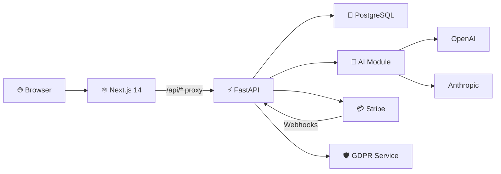

# 🚀 AI SaaS Starter

Full-stack AI SaaS starter — FastAPI + Next.js + Stripe + multi-tenancy + GDPR.

      

---

## Architecture



## Key Features

🤖 **AI Module** — Chat, summarize, analyze with pluggable LLM abstraction (OpenAI, Anthropic, custom providers)

🏢 **Multi-tenancy** — Row-level data isolation between tenants with `tenant_id` on every scoped table

🔐 **Auth & RBAC** — JWT access + refresh tokens, bcrypt hashing, roles: owner / admin / member

💳 **Stripe Billing** — Three-tier subscriptions (free / starter / pro), webhook handlers, billing portal

🇪🇺 **GDPR Compliance** — Tenant & user data export, deletion (Art. 17), audit log anonymization (Art. 20)

🚀 **Production Ready** — Docker Compose, GitHub Actions CI/CD, 93% test coverage, structured logging

## Tech Stack

| Backend | Frontend |
|---|---|
| FastAPI 0.115+ | Next.js 14 |
| SQLAlchemy 2.0 (async) | TypeScript |
| PostgreSQL + asyncpg | Tailwind CSS |
| Alembic migrations | Axios |
| python-jose (JWT) | Inter font |
| bcrypt | Dark theme UI |
| Stripe API (httpx) | |
| structlog | |
| pydantic-settings v2 | |

## Quick Start

```bash
git clone https://github.com/ForwardCodeSolutions/ai-saas-starter.git
cd ai-saas-starter
cp .env.example .env
docker compose up -d
```

| Service | URL |
|---|---|
| API docs (Swagger) | http://localhost:8003/docs |
| Frontend | http://localhost:3000 |
| PostgreSQL | localhost:5433 |

## API Endpoints

### Auth

| Method | Endpoint | Description | Auth |
|---|---|---|---|
| POST | `/api/v1/auth/register` | Register tenant + owner | — |
| POST | `/api/v1/auth/login` | Authenticate, get tokens | — |
| POST | `/api/v1/auth/refresh` | Refresh access token | — |
| POST | `/api/v1/auth/logout` | Revoke refresh token | — |
| GET | `/api/v1/auth/me` | Current user info | ✅ |

### Users

| Method | Endpoint | Description | Auth |
|---|---|---|---|
| GET | `/api/v1/users` | List tenant users | Admin+ |
| POST | `/api/v1/users/invite` | Invite user to tenant | Owner |
| PUT | `/api/v1/users/{id}` | Update role / status | Admin+ |
| DELETE | `/api/v1/users/{id}` | Deactivate user | Owner |

### AI

| Method | Endpoint | Description | Auth |
|---|---|---|---|
| POST | `/api/v1/ai/chat` | Chat completion | ✅ |
| POST | `/api/v1/ai/summarize` | Text summarization | ✅ |
| POST | `/api/v1/ai/analyze` | Text analysis | ✅ |
| GET | `/api/v1/ai/usage` | Usage stats (30 days) | ✅ |

### Billing

| Method | Endpoint | Description | Auth |
|---|---|---|---|
| GET | `/api/v1/billing/plans` | List available plans | — |
| POST | `/api/v1/billing/subscribe` | Create subscription | ✅ |
| POST | `/api/v1/billing/cancel` | Cancel subscription | ✅ |
| GET | `/api/v1/billing/portal` | Stripe billing portal | ✅ |
| GET | `/api/v1/billing/current` | Current plan & status | ✅ |

### GDPR

| Method | Endpoint | Description | Auth |
|---|---|---|---|
| GET | `/api/v1/gdpr/export` | Export tenant data | ✅ |
| DELETE | `/api/v1/gdpr/tenant` | Delete all tenant data | ✅ |
| GET | `/api/v1/gdpr/user/export` | Export user data | ✅ |
| DELETE | `/api/v1/gdpr/user` | Delete user data | ✅ |
| POST | `/api/v1/gdpr/anonymize-logs` | Anonymize audit logs | ✅ |

### Admin & System

| Method | Endpoint | Description | Auth |
|---|---|---|---|
| GET | `/api/v1/admin/dashboard` | Tenant stats dashboard | ✅ |
| POST | `/api/v1/webhooks/stripe` | Stripe webhook handler | Signature |
| GET | `/api/v1/health` | Health check | — |

## Subscription Plans

| Plan | Price | AI Calls | Users | Support |
|---|---|---|---|---|
| **Free** | $0 | 100/month | 1 | Community |
| **Starter** | $29/mo | 5,000/month | 5 | Email + priority models |
| **Pro** | $99/mo | Unlimited | Unlimited | Priority + all models + custom integrations |

## Design Decisions

| ADR | Title | Summary |
|---|---|---|
| [ADR-001](docs/decisions/ADR-001-fastapi-react.md) | FastAPI + React | Async Python + Next.js over Django/Node alternatives |
| [ADR-002](docs/decisions/ADR-002-llm-abstraction.md) | LLM Abstraction Layer | Custom provider interface over LangChain for control and simplicity |
| [ADR-003](docs/decisions/ADR-003-multi-tenancy.md) | Row-Level Multi-tenancy | `tenant_id` FK on all scoped tables, not schema-per-tenant |
| [ADR-004](docs/decisions/ADR-004-ai-usage-tracking.md) | AI Usage Tracking | Dedicated table tracking tokens, cost, model per call |
| [ADR-005](docs/decisions/ADR-005-stripe-billing.md) | Stripe Billing | Subscription tiers with webhook lifecycle management |

## Test Suite

**69 tests** across unit and integration suites — **93% code coverage**.

Coverage excludes real HTTP providers (OpenAI, Anthropic, Stripe) which are mocked in tests.

```
Unit tests:     31 tests (models, security, auth, LLM router, Stripe, GDPR service)
Integration:    38 tests (auth API, AI API, billing API, GDPR API, full SaaS flow)
```

```bash
make test          # run all tests with coverage
make lint          # ruff check + format
make check         # lint + test
```

## Project Structure

```
├── backend/src/saas_starter/
│   ├── ai/                    # LLM abstraction layer
│   │   ├── providers/         # OpenAI, Anthropic, Mock
│   │   ├── features/          # chat, summarize, analyze
│   │   └── router.py          # model-prefix routing
│   ├── api/v1/                # FastAPI routers
│   ├── core/                  # config, database, security, exceptions
│   ├── models/                # SQLAlchemy ORM models
│   ├── schemas/               # Pydantic request/response
│   └── services/              # auth, stripe, gdpr, usage
├── frontend/
│   ├── app/                   # Next.js 14 app router pages
│   ├── components/            # Navbar, AuthGuard
│   └── lib/                   # API client (axios)
├── tests/
│   ├── unit/                  # 6 unit test modules
│   └── integration/           # 5 integration test modules
├── docs/decisions/            # 5 Architecture Decision Records
├── docker-compose.yml
├── Makefile
└── pyproject.toml
```

## Disclaimer

> ⚠️ This is a starter template. Review and update security settings,
> secret keys, and CORS configuration before production use.

## License

MIT © 2026 ForwardCodeSolutions
