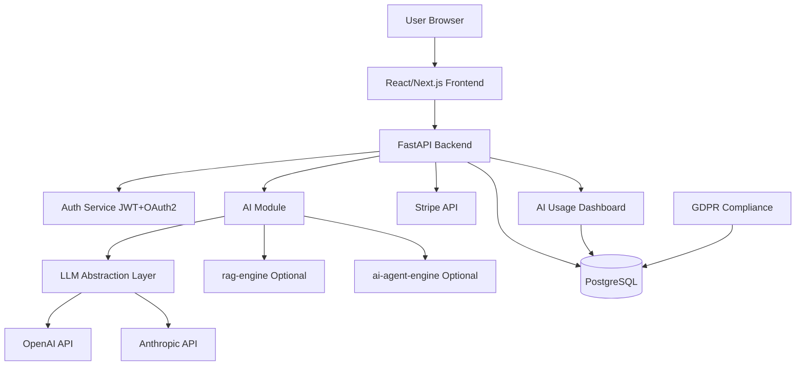

# Architecture

## System Overview

## Components

### Backend (FastAPI)
- **api/** — HTTP routes organized by domain (auth, ai, billing, gdpr, admin)
- **core/** — Configuration, security utilities, dependency injection
- **ai/** — LLM abstraction layer, chat/summarize/analyze services
- **auth/** — JWT token management, OAuth2, RBAC
- **models/** — SQLAlchemy ORM models
- **schemas/** — Pydantic request/response schemas
- **services/** — Business logic layer
- **utils/** — Shared utilities

### Frontend (React/Next.js)
- Login/Register pages
- AI Chat interface
- AI Usage Dashboard (charts)
- Settings page (plan, data export/delete)

### Database (PostgreSQL)
- Row-level multi-tenancy with tenant_id
- Alembic migrations

### External Services
- **OpenAI / Anthropic** — LLM providers via abstraction layer
- **Stripe** — Subscription and usage-based billing
- **rag-engine** — Optional document search module
- **ai-agent-engine** — Optional agent orchestration module
