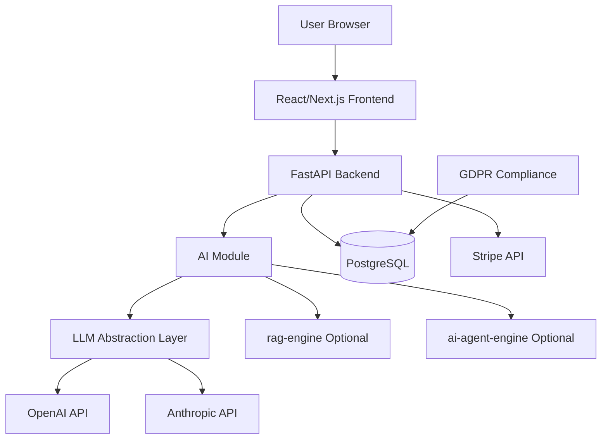

# Architecture

## System Overview

## Components

### Backend (FastAPI)
- **api/v1/** — HTTP routes organized by domain (auth, users, ai, billing, gdpr, admin, webhooks)
- **api/deps.py** — Dependency injection (DB sessions, JWT auth, RBAC)
- **core/** — Configuration (`config.py`), security utilities (`security.py`), database setup (`database.py`), custom exceptions (`exceptions.py`)
- **ai/** — LLM abstraction layer (`base.py`, `router.py`), feature implementations (`features/chat.py`, `features/summarize.py`, `features/analyze.py`), providers (`providers/openai_provider.py`, `providers/anthropic_provider.py`, `providers/mock_provider.py`)
- **models/** — SQLAlchemy ORM models (User, Tenant, Subscription, AIUsage, AuditLog)
- **schemas/** — Pydantic request/response schemas
- **services/** — Business logic (auth_service, stripe_service, usage_service, gdpr_service)

### Frontend (React/Next.js)
- Landing page
- Login/Register pages
- AI Chat interface
- Dashboard page

### Database (PostgreSQL)
- Row-level multi-tenancy with `tenant_id` on all data tables
- Alembic migrations (located in `backend/alembic/`)

### External Services
- **OpenAI / Anthropic** — LLM providers via abstraction layer (ADR-002)
- **Stripe** — Subscription billing with webhook integration (ADR-005)
- **rag-engine** — Optional document search module
- **ai-agent-engine** — Optional agent orchestration module
